# 大学生心理健康测评小程序(文末获取方式☟)
> 
#### 介绍
大学生心理健康测评小程序(Java_SpringBoot_微信小程序)
有BUG可留言加微

#### 软件架构
Java + SpringBoot + 微信小程序 + Mybatis + Mysql

#### 项目功能说明

> + 系统分为管理员、咨询师、用户三个角色
> + 登录注册
> + 管理员管理、咨询师管理、用户管理
> + 心理健康管理、心理健康留言管理、心理健康咨询管理
> + 咨询师预约管理
> + 心理测评管理
> + 题目管理
> + 心理测评记录
> + 通知公告管理
> + 数据基础管理：公告类型管理、心理健康类型管理
> + 论坛管理
> + 轮播图管理

### 部分功能演示

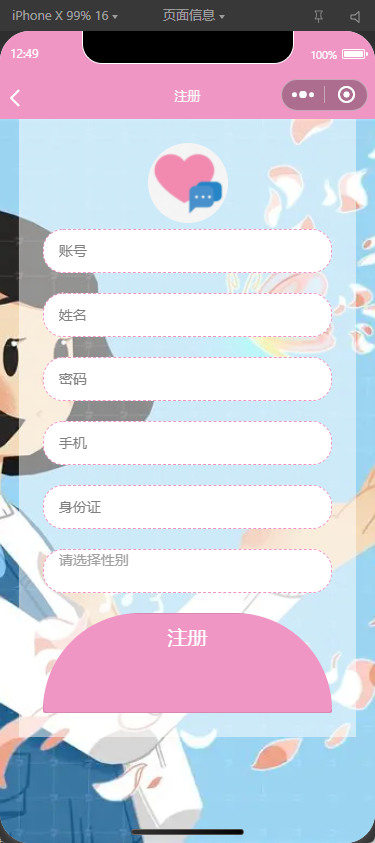
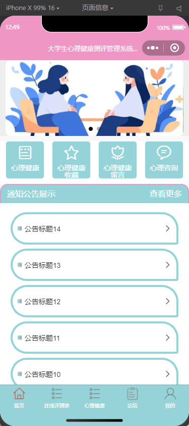

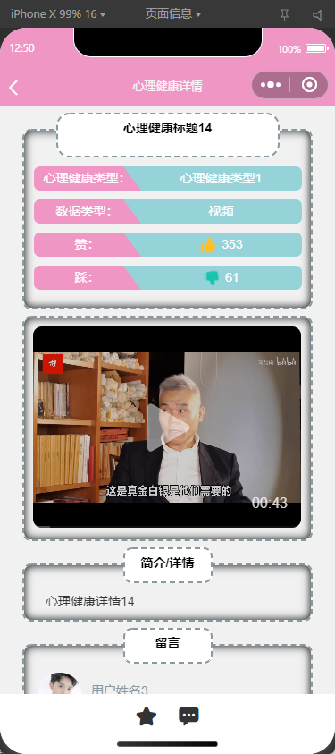
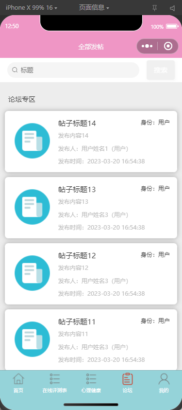
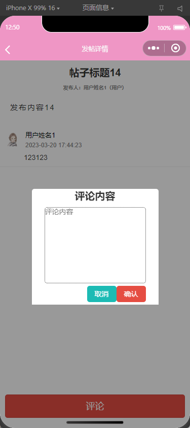
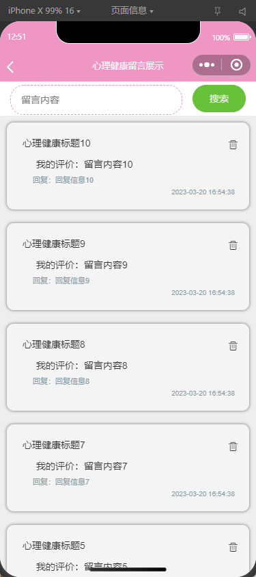
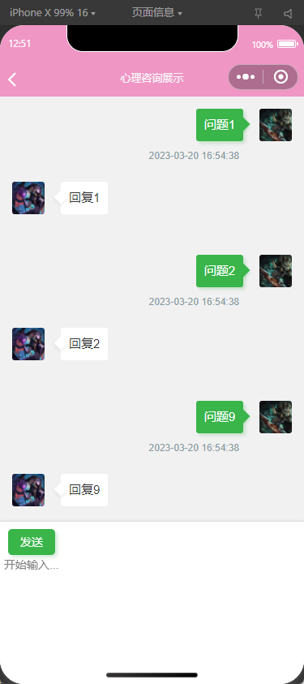
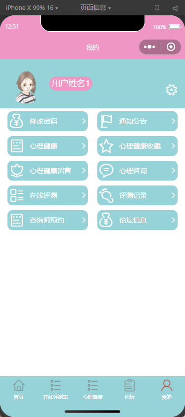

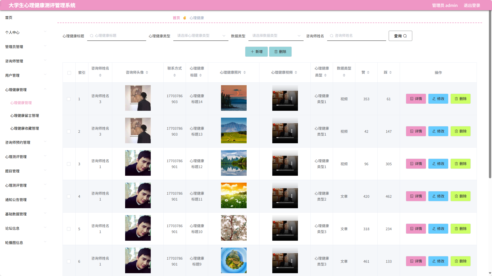
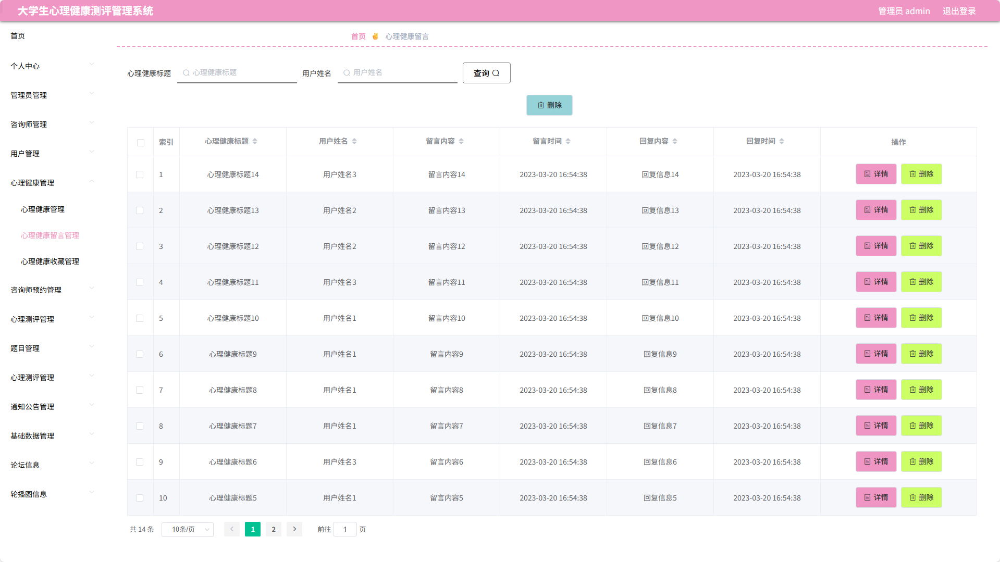
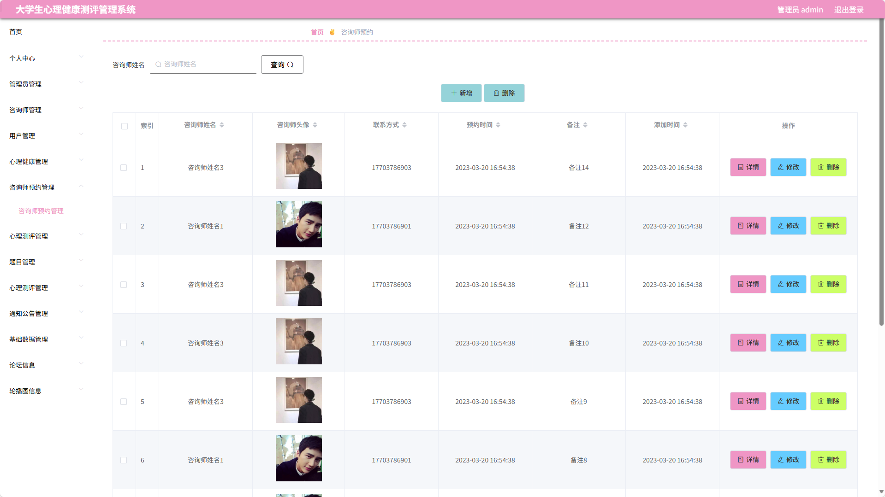
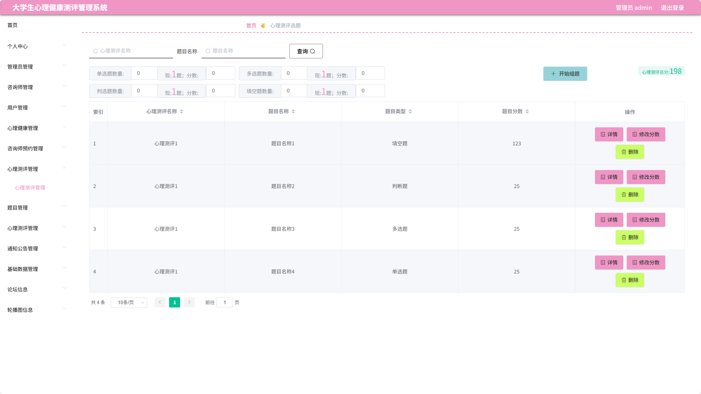
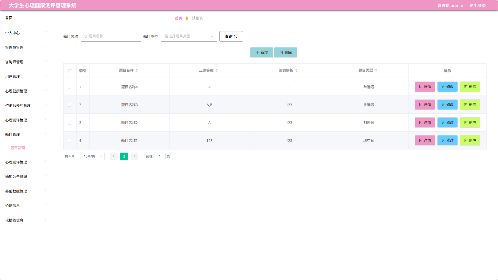
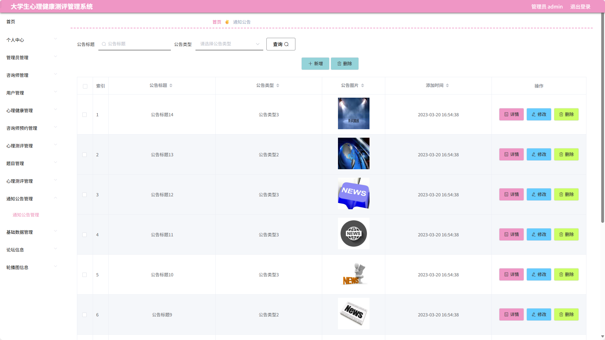

### 环境需求(可免费提供)
- idea/eclipse、jdk-1.8、maven-3.8.6、mysql、node.js等

## 有项目修改、安装调试需求 请联系以下

## 获取资源扫☝☝☝

